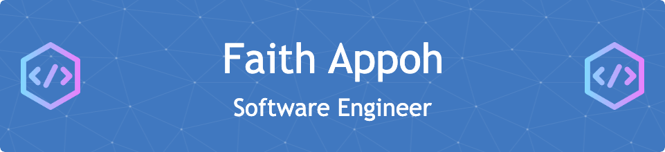

  

<h1 align="center">
Hi there, I'm <a href="https://kodjocode.vercel.app/" target="_blank" rel="noreferrer">Faith</a> 👋
</h1>

<h4 align="center">
I'm Software Engineer specialising in Web frontend 💻
</h4>

I love the entire process of developing creative digital solutions to help people.

### 🤝 Connect with me

 

- 💬 If you have any question/feedback, please do not hesitate to reach out to me!

## 🔭 I'm currently working on

- [Portions and Passion](https://www.portionsandpassion.com/)
- Something big!

## Read my blog

## Technical Skills

 

## Cloud

 

 

### Work Environment

 

<!-- ## 📝 Latest Blog Posts

- [How to Create a Beautiful README for Your GitHub Profile](https://yushi95.medium.com/how-to-create-a-beautiful-readme-for-your-github-profile-36957caa711c)

  -->

## 📈 GitHub Stats

<!--
**appohfaiths/appohfaiths** is a ✨ _special_ ✨ repository because its `README.md` (this file) appears on your GitHub profile.

Here are some ideas to get you started:

- 🔭 I’m currently working on ...
- 🌱 I’m currently learning ...
- 👯 I’m looking to collaborate on ...
- 🤔 I’m looking for help with ...
- 💬 Ask me about ...
- 📫 How to reach me: ...
- 😄 Pronouns: ...
- ⚡ Fun fact: ...
-->
